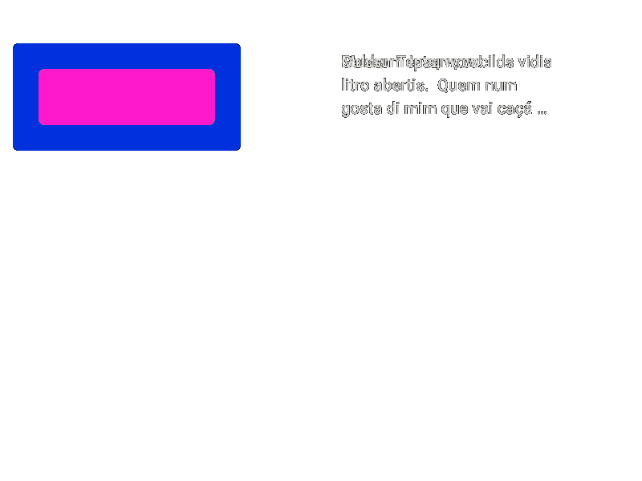
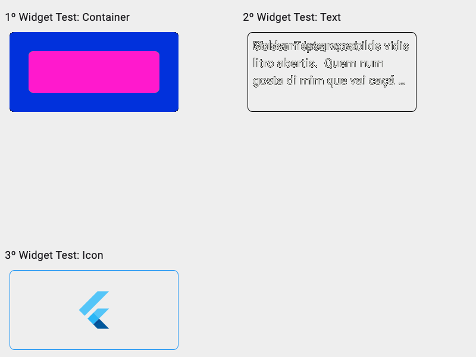
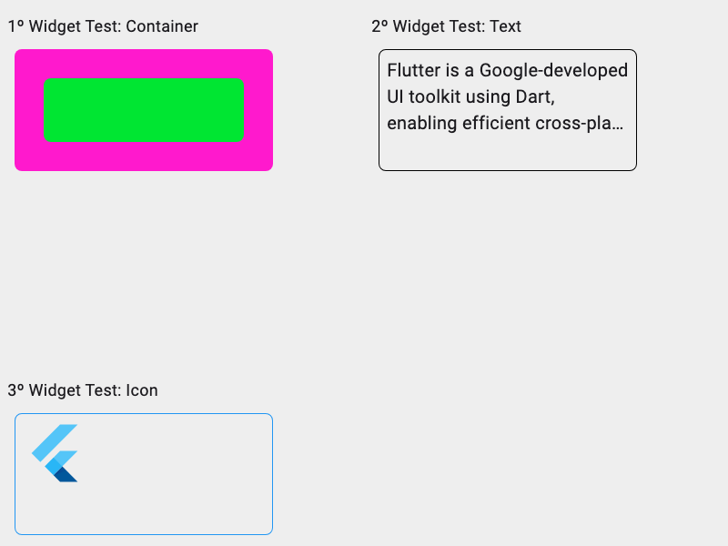

**Flutter Golden Tests Project**

Este projeto exemplifica o uso de testes golden no Flutter, demonstrando como verificar visualmente se as alterações na interface do usuário afetam adversamente a aparência esperada da aplicação. Além disso, um workflow automatizado foi criado para facilitar a execução e visualização dos resultados dos testes.

**Intuito do Projeto**

O objetivo deste projeto é fornecer uma estrutura clara e compreensível para realizar testes visuais em páginas e widgets Flutter. Os testes golden são uma técnica poderosa para garantir a consistência visual da interface do usuário, permitindo que os desenvolvedores detectem regressões visuais e validem as alterações de layout.

**Recursos do Projeto**

1. **Testes Golden no Flutter:** O projeto contém exemplos de testes golden que são capazes de verificar se a aparência visual da aplicação está de acordo com a expectativa, comparando a renderização atual com uma renderização previamente aceita.

2. **Workflow Automatizado:** Um workflow foi configurado para executar os testes automaticamente e disponibilizar os arquivos gerados para análise. Este fluxo de trabalho simplifica o processo de execução e permite que os usuários comparem visualmente as alterações na interface do usuário.

3. **Parâmetros Personalizáveis:** O workflow aceita três parâmetros: `color`, `text` e `alignment`. Esses parâmetros permitem que o usuário manipule propriedades específicas na tela, resultando em variações na aparência da aplicação. Isso possibilita uma análise detalhada das diferenças visuais entre diferentes estados da aplicação.

---

**Arquivos Gerados pelos Testes**

**Tela - Isolated Differences:**

**Tela - Masked Differences:**

**Tela - Original Image:**

**Tela - Test Image:**

**Widgets:**

**Widgets - Isolated Differences:**!

**Widgets - Masked Differences:**!

**Widgets - Original Image:**!

**Widgets - Test Image:**!

---

Este arquivo README fornece uma visão geral do projeto, explicando seu propósito, recursos e como acessar os resultados dos testes visuais gerados. Utilize os arquivos fornecidos para analisar as diferenças entre as renderizações e garantir a integridade visual da sua aplicação Flutter.